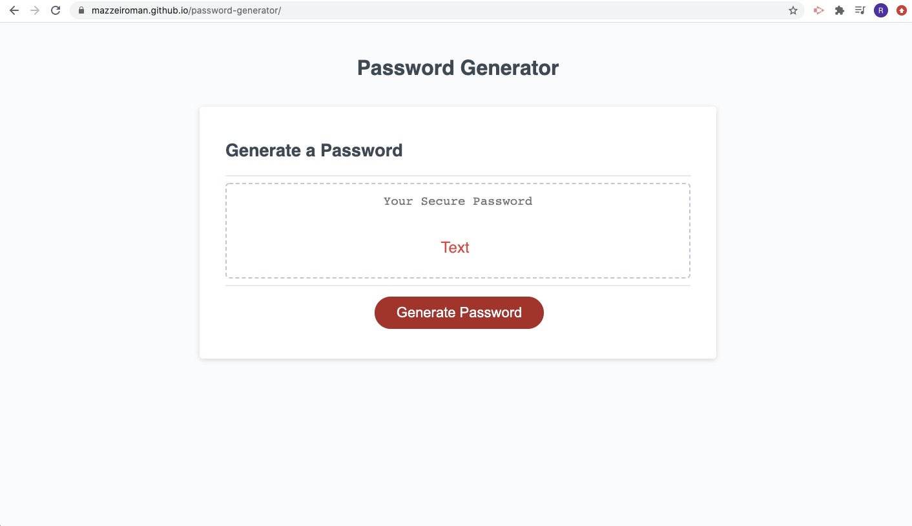
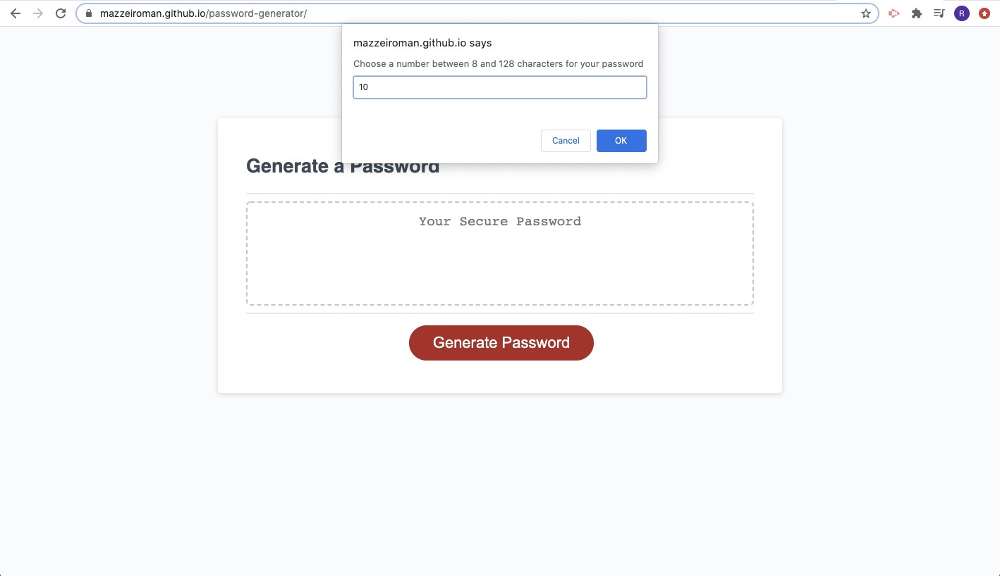
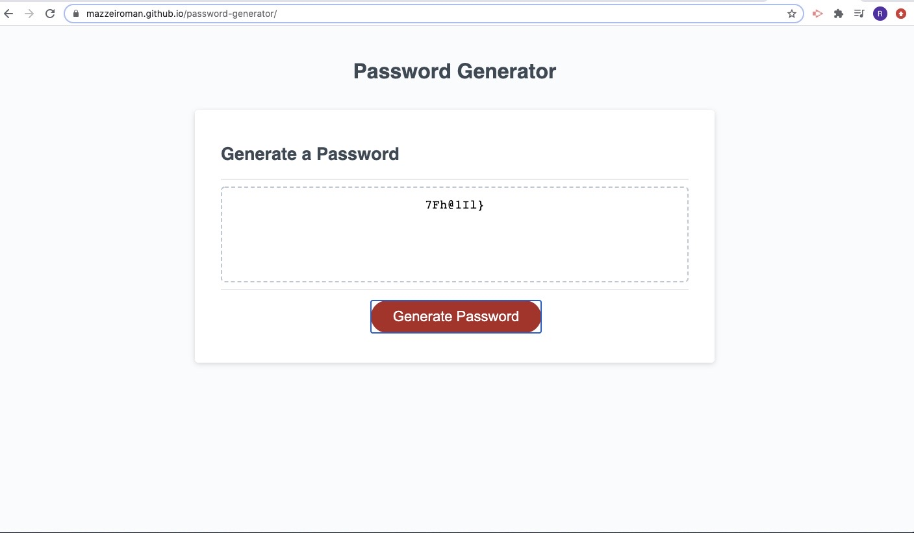

# Password-generator
Random password generator web page, using JavaScript, this page generates a random password based on user-selected criteria. This web page will run in the browser and feature dynamically updated HTML and CSS powered by JavaScript code. It also features a clean and polished user interface and is responsive, ensuring that it adapts to multiple screen sizes.

## Files and Directories

```
index.html
script.js
style.css
README.md
>Images (the directory contains images of how the deployed application looks on a desktop computer)
```

## Link to the deployed website
https://mazzeiroman.github.io/password-generator/





## Credits

© 2020 Roman Mazzei.